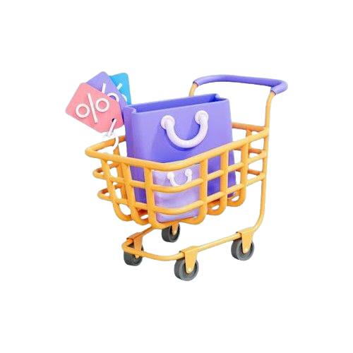

# Capstone Project Final Score


# Superstore Dashboard
<p align="center">
  
</p>

## Support
We appreciate your support!

<div style="display: flex; justify-content: center;">
  <div style="margin-right: 20px;">
    
  </div>
  <div style="margin-left: 20px;">
    
  </div>
</div>

## Project Overview
Welcome to the Superstore Dashboard! This project is designed to provide comprehensive data analytics for a superstore, offering insights into sales, profits, and other key metrics through interactive charts and visualizations.

## Features
- **Interactive Charts**: Various types of charts (pie, bar, doughnut & etc.) to visualize data effectively.
- **Responsive Design**: Ensures the dashboard looks good on all devices.

## <summary><strong>Tools:</strong></summary>
<p>
    
</p>

## Team Members
Our project is a collaborative effort by the following team members:

- **Julia Ressi Irrenova Yulistia** as Team Leader
- **Deni Kristanto** as Front-End Developer
- **Defrizal Arif Rahma** as Front-End Developer
- **Melly Isnulsari** as Deployment
- **Akhirul Abqar** as Deployment
- **Anggita Dwi Sulistiani** as Pitch Deck
- **Sanny Mariani Hisarma** as Pitch Deck
- **Paskah Magdalena S.** as Pitch Deck
- **Ririn Nur Fatimah** as Quality Assurance
- **Alvinida Khafiah** as Quality Assurance


## Technologies Used
- **HTML**: Structure of the dashboard
- **CSS**: Styling and layout
- **JavaScript**: Interactivity and chart implementations (using Chart.js)
- **Chart.js**: Library for creating charts
- **netlify**: Deployment platform for hosting and continuous deployment

## Setup Instructions
1. Clone the repository to your local machine.
    ```bash
    git clone https://github.com/Kampus-Merdeka-Software-Engineering/km-feb24-balikpapan-13.git
    ```
2. Navigate to the project directory.
    ```bash
    cd km-feb24-balikpapan-13
    ```
3. Open `index.html` in your web browser to view the dashboard, or visit our website team : https://km-feb24-balikpapan-13.netlify.app/


## Contact Information
For any inquiries or further information, please contact any of the team members through our website.

---

&copy; 2024 Superstore Dashboard By Team 13 - Balikpapan. All rights reserved.
